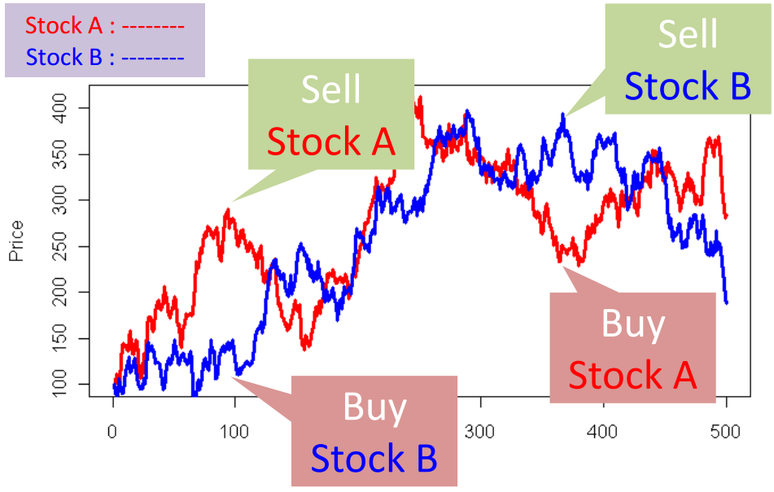

Neste documento vamos aplicar a teoria da cointegração aprendida em sala de aula para definir uma estratégia de operação na bolsa de valores. A ideia é simples: se duas séries tem dependência de longo prazo e, no curto prazo uma série temporal se descola da outra, espera-se que, após algum tempo, haverá uma reversão para a ourta série temporal.

Para alcançar nosso objetivo, as seguintes atividades serão desenvolvidas:


1. Instalar o pacote quantmod - este é um pacote de finanças e tornará nosso serviço muito mais fácil;
 
2. Vamos trabalhar com as séries de ações de dois dos principais bancos privados brasileiros: Bradesco e Itaú. Antes de iniciar nossa estratégia de operação, vamos fazer uma análise exploratória dessas duas séries temporais;
 
3. Criar uma estratégia de curto prazo para operar as ações;
 
4. Long-Short através de Cointegração: um exemplo usando o pacote PairTrading.

\


### 1. Instalar o pacote quantmod

O pacote quantmod apresenta diversas funcionalidades, recomendo fortemente que conheçam o site do pacote - http://www.quantmod.com/ - e que explorem ao máximo todas as suas funções.

```{r, message= FALSE}
#install.packages("quantmod")
require(quantmod)
```

\


### 2. Análise exploratória: Bradesco e Itaú

Primeiramente, vamos consultar o valor das ações desses dois bancos e observa-las graficamente.

```{r, message= FALSE}
## Banco Bradesco S.A.
getSymbols('BBDC4.SA',src='yahoo')
head(BBDC4.SA)
tail(BBDC4.SA)
chartSeries(BBDC4.SA)

## Itaúsa - Investimentos Itaú S.A.
getSymbols('ITSA4.SA',src='yahoo')
head(ITSA4.SA)
tail(ITSA4.SA)
chartSeries(ITSA4.SA)
```


Que tal agora observarmos algum período da série?

```{r, message= FALSE}
## últimos 12 meses
chartSeries(BBDC4.SA,subset = 'last 12 months')
chartSeries(ITSA4.SA,subset = 'last 12 months')

## últimos 4 meses
chartSeries(BBDC4.SA,subset = 'last 4 months')
chartSeries(ITSA4.SA,subset = 'last 4 months')

## podemos também observar os gráficos das duas ST ao mesmo tempo
head(as.xts(merge(BBDC4.SA,ITSA4.SA)))
chartSeries(c(BBDC4.SA, ITSA4.SA))
```

\


### 3. Modelo básico de curto prazo para operar ações: bandas de Bollinger


Outra ferramenta interessante do quantmod são das bandas de Bollinger (https://en.wikipedia.org/wiki/Bollinger_Bands). 

O conceito é simples, mas lógico. Procura usar uma ideia clássica e sólida. A ideia de que os preços não se afastam por muito tempo de uma média de valores, procurando retornar a essa média de tempos em tempos. Logo, a banda é construída projetando uma quantidade de desvios padrões acima e abaixo desta média.

Com isso, conseguimos observar situações de sobrevenda e de sobrecompra, conseguimos estabelecer suportes e resistencias, conseguimos estabelecer tendência de alta ou de baixa e ainda observar a expansão ou retração da volatilidade do ativo (http://lseducacao.com.br/como-operar-bandas-de-bollinger/).


Bollinger Bands consist of:

a. an N-period moving average (MA)

b. an upper band at K times an N-period standard deviation above the moving average (MA + Kσ)

c. a lower band at K times an N-period standard deviation below the moving average (MA − Kσ)


Typical values for N and K are 20 and 2, respectively.

Conforme observado, o default é 20,2, mas o quantmod me permite escolher as bandas. Foi isso que eu fiz para as ações do Bradesco.


```{r, message= FALSE}
chartSeries(BBDC4.SA, subset = 'last 12 months', theme="white",TA="addVo();addBBands(30,2);addCCI()") 

chartSeries(ITSA4.SA, subset = 'last 12 months', theme="white",TA="addVo();addBBands();addCCI()") 

```

\


### 4. Long-Short através de Cointegração: um exemplo usando o pacote PairTrading


Estratégias de arbitragem estatística são baseadas em encontrar uma série temporal que possua a característica de estacionariedade ou reversão à média. Isto significa que é possível identificar situações em que a série divergiu de seu comportamento histórico, e prever com alguma segurança que a série convergirá ou reverterá para um comportamento “médio”. O conceito de cointegração formaliza matematicamente este comportamento e permite a realização de testes estatísticos para detectar séries com este comportamento. 

No contexto de operações com pares de ativos (pairs trading), a existência de uma relação de cointegração entre as séries de preços de dois ativos significa que pode ser possível realizar operações lucrativas de arbitragem. Por outro lado, se o par não for cointegrado, será impossível encontrar uma relação consistente para operar o par.

É necessário termos um teste para identificar quais pares de ações são cointegrados. Mesmo dentro do universos dos pares que são cointegrados, não há garantia de sucesso. É preciso que o par possua algumas características específicas para que uma estratégia de arbitragem seja consistentemente lucrativa:

    a. Relação de cointegração estável ao longo do tempo
    b. Reversão frequente do spread à média
    c. Variabilidade razoavelmente grande nas divergências

\

**4.1. Quais são os passos para operar com pares de ações?**

Para operar com pares de ações, os seguintes passos devem ser seguidos:

 1 - selecionar duas ações que movem similarmente;
 
 2 - ideia básica: vamos vender as ações com preço elevado e comprar as ações com preço baixo;




 3 - Monitorar as diferenças entre as duas ações (isso no curto prazo);
 
 4 - No longo prazo eu posso usar a teoria da cointegração para fazer esse monitoramento;

 5 - Regra de Decisão:
 
$$ spread = log(Y_t) - (alpha + beta*log(X_t))$$, onde $Y_t$ e $X_t$ são ações.

  -------------------------------------
  Se $spread$ > muito alto: compra-se $X_t$ e vende-se $Y_t$
  Se $spread$ < muito baixo: compra-se $Y_t$ e vende-se $X_t$
  -------------------------------------

\

**4.2. Vamos agora fazer uma simulaçao usando a linguagem R**

Vamos agora fazer uma simulaçao usando a linguagem R. Para isso precisamos executar as seguintes tarefas:


 1 - Selecionar duas ações que movem similarmente;\
 2 - Estimar o spread\
 3 - Checar a estacionariedade\
 4 - Criar o sinal de trading\
 5 - Rodar o backtest\

\

*1 - Selecionar duas ações que movem similarmente*


```{r, message= FALSE}
BBDC4.SA_2010 <- BBDC4.SA['2013::'] 
ITSA4.SA_2010 <- ITSA4.SA['2013::'] 
pairs <- cbind(BBDC4.SA_2010$BBDC4.SA.Close,ITSA4.SA_2010$ITSA4.SA.Close)
ts.plot(pairs)

#install.packages("dygraphs")
require(dygraphs)

dygraph(pairs) %>%
  dySeries("BBDC4.SA.Close", axis = 'y2')

```

\

*2 - Estimar o spread*

O pacote **PairTrading** não está mais disponível na versão mais nova do R, dessa forma, para trabalharmos com o pacote iremos utilizar o pacote que está disponível no Github.


```{r, message= FALSE}
# install.packages("devtools")
require(devtools)
install_github("cran/PairTrading")
require(PairTrading)

```

Utiliando o pacote **PairTrading** vamos estimar o spread entra as ações do Itaú e do Bradesco. A primeira coisa que precisamos fazer é estimar a regressão abaixo:

$$ log(Y_t) = alpha + beta*log(X_t) + u_t$$

```{r, message= FALSE}
## Estimando o spread
reg <- EstimateParameters(pairs, method = lm)

## o resíduo da regressão 1 é o mesmo que o spread. O que ele chama de spread é o resíduo da regressão 1
reg1 = lm(log(pairs[,2]) ~ log(pairs[,1]))
head(reg1$residuals[,])
head(reg$spread[,])

```

\
A parte mais importante desse modelo é o spread (ou erro do modelo), então, vamos plota-lo.
\

```{r}
plot(as.numeric(na.omit(reg$spread)),type = "l")
```

Como já aprendemos em sala de aula, duas ST serão cointegradas se o resíduo dessa regressão for estacionário. Graficamente parece que o spread é estacionário. Vamos conferir essa informação estatísticamente?!

\

*3 - Checar a estacionariedade*

Para verificar se as séries são cointegradas, vamos testar a estacionariedade dos resíduos.

```{r}
#check stationarity
#install.packages("urca")
require(urca)
adf_reg <- ur.df(as.numeric(na.omit(reg$spread)), type = "none", lags = 13, selectlags = "AIC")

summary(adf_reg) 
```

Como podemos observar, a estatística de teste (-5.0931) é menor que o valor crítico a 1% (-2.58), logo temos um resíduo estacionário.

\

*4 - Estimando os parâmetros para o back-test*

Para rodar o back-test nós precisamos estimar os parâmetros historicamente usando a função "EstimateParametersHistorically". Esse função faz algo como uma “rolling regression” para estimar os parâmetros. Por isso ela é diferente da função “EstimateParameter”.

\
```{r}
#estimate parameters for back test
params <- EstimateParametersHistorically(pairs, period = 180)
View(params)
# hedge.ratio = constante
# premiun = inclinação
```


** Criando o sinal para a operação**

Agora, nós vamos criar o sinal para a operação usando o "spread". A função "Simple" nos dá uma estratégia de operação bem simples: se o spread é maior (menor) que um valor específico, nós iremos comprar (vender). 

Neste nosso caso, nós fixamos nosso "valor específico" em $0.05$, então, baseado na nossa regressão:

$$ log(ITAU_t) = alpha + beta*log(BRAD_t) + u_t$$

onde o spread é igual ao erro ($u_t = spread$)

$$ spread_t = log(ITAU_t) - (alpha + beta*log(BRAD_t))$$

Então, iremos comprar Bradesco, se o spread for maior que $0.05$ e comprar Itaú, se o spread for menor que $-0.05$. O gráfico abaixo mostra os pontos em que devemos comprar uma ou outra ação. 

*manchas azuis na margem inferior (spread maior que $0.05$)* -> compro Itaú
*manchas azuis na margem superior (spread menor que $-0.05$)* -> compro Bradesco

```{r}

#create & plot trading signals
signal <- Simple(params$spread, 0.05)
barplot(signal,col="blue",space = 0, border = "blue",xaxt="n",yaxt="n",xlab="",ylab="")
par(new=TRUE)

plot(params$spread)

# PROVA: como o sinal é criado
prova <- cbind(signal,params$spread)
View(prova)

```

\

*5 - Back-test performance*


A questão é a seguinte: fiquei rico?!!

```{r}
#Performance of pair trading
return.pairtrading <- Return(pairs, lag(signal), lag(params$hedge.ratio))
plot(100 * cumprod(1 + return.pairtrading))
```

\
\


**4.3. Podemos também estimar o parâmetro de cointegração**


```{r Teste de RU}
require(urca)
adf_BBDC4 <- ur.df(BBDC4.SA_2010$BBDC4.SA.Close, type = "drift", lags = 13, selectlags = "AIC")
summary(adf_BBDC4) 
```


```{r}
ajuste_coin1 <- lm(pairs[,1] ~ pairs[,2] - 1)
summary(ajuste_coin1)
adf_coin1 <- ur.df(as.numeric(ajuste_coin1$residuals), "none", lags = 12, selectlags = "AIC")
summary(adf_coin1)
#BETS.corrgram(adf_coin1@res)
```


```{r Procedimento em duas etapas}
#install.packages("dynlm")
require(dynlm)

## Primeira etapa - calcular o resíduo da regressão em nível
## pairs[,2] -> ITSA4.SA
## pairs[,1] -> BBDC4.SA


reg1 = lm(log(pairs[,2]) ~ log(pairs[,1]))
summary(reg1)
plot(as.numeric(reg1$residuals),type = "l") 

head(reg1$residuals[,])


## Segunda etapa - calcular a segunda regressão
BBDC4.SA <- ts(pairs[,1],start = c(2013,1,1),frequency = 365)
ITSA4.SA <- ts(pairs[,2],start = c(2013,1,1),frequency = 365)
RESID_REG1 <- ts(reg1$residuals, start = c(2013,01), freq = 365)

reg2 = dynlm(d(log(ITSA4.SA), 1) ~ d(log(BBDC4.SA), 1) + L(RESID_REG1, 1) - 1) 
summary(reg2)

```


\
\
\


#### Referências
\
**Modelo básico para operar pares de ações** - 
https://drnickel.wordpress.com/2013/07/20/modelo-basico-para-operar-pares-de-acoes/
\
***Long-Short através de Cointegração** - https://drnickel.wordpress.com/2015/03/15/long-short-atraves-de-cointegracao-parte-1/
\
**Quantmod** - http://www.quantmod.com/documentation/quantmod-poster.pdf
\
**PairTrading package** - https://github.com/cran/PairTrading
\

http://www.slideshare.net/kohta/introduction-to-pairtrading
\
https://www.r-bloggers.com/pair-trading-strategy-how-to-use-pairtrading-package/

